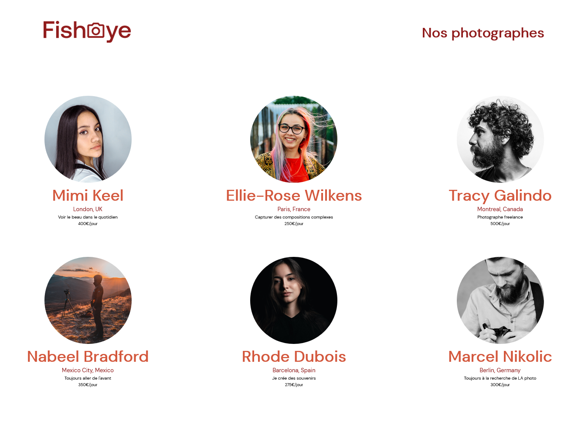
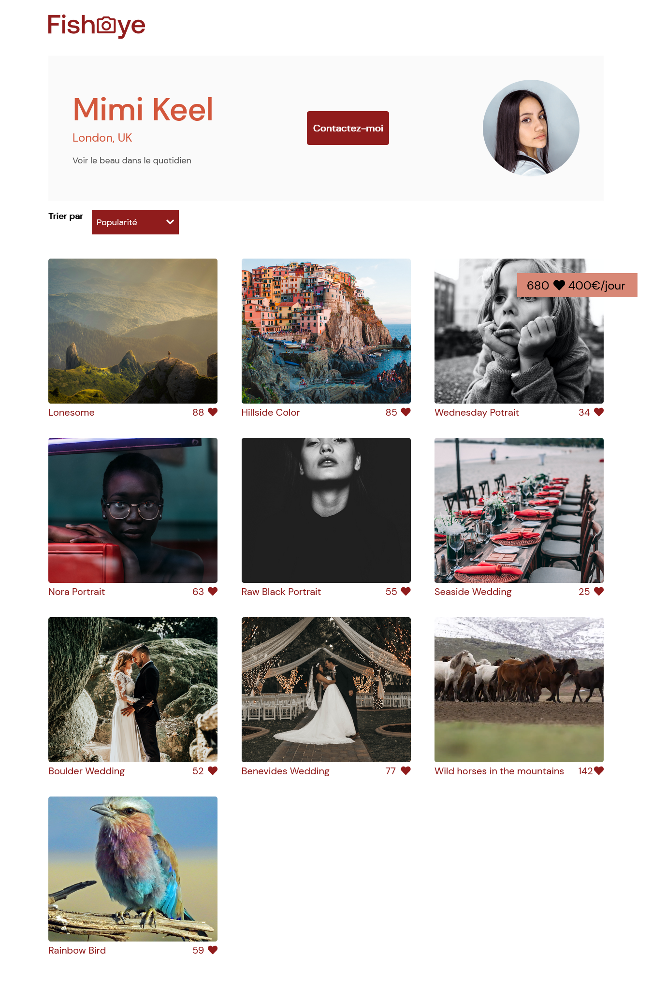

# Fisheye 

*Projet fictif de formation n°4/11 / OpenClassrooms*

### Home page 

### Selected photographer 

## Contexte 
Fisheye est une plateforme d'exposition pour photographes freelance professionnels. Chaque photographe bénéficie d'une visibilité sur la page d'accueil et dispose d'un espace professionnel avec galerie et formulaire de contact.

## Problématique 
Le site est obsolète, il doit être remanié et transformé en site dynamique.

## Livrable 
    - page d'accueil
    - page professionnelle d'un photographe
    - intégration via base de données (fetch API)
    - accessibilité utilisateurs malvoyants
    - lightbox (galerie photos)
    - formulaire de contact

## Compétences développées
    - Développer une application web modulaire avec des design patterns
    - Assurer l'accessibilité d'un site web
    - Ecrire du code JavaScript maintenable
